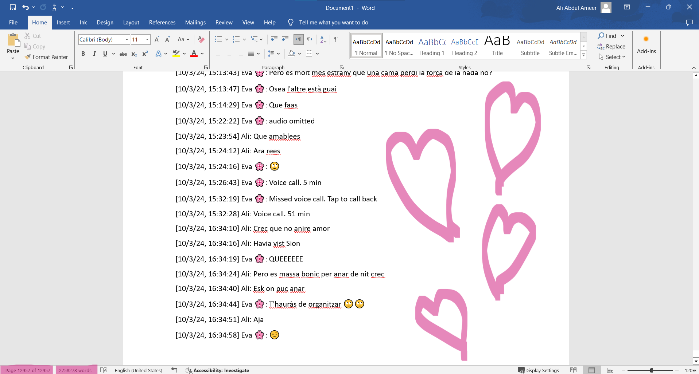

# El llibre de l'amor

WhatsApp ha esdevingut el llibre de la nostra relació, una crònica viva dels nostres moments compartits. I si teniu dubtes, us convido a que ho comproveu per vosaltres mateixos. Entreu avui mateix a una conversa amb algú important i trieu un dia al atzar; quedareu sorpresos pels resultats que hi trobareu. Retrobareu instants memorables, moments d'intimitat i connexió, i fins i tot aquells moments que ens han posat a prova. En preparar aquest regal, confesso que una llàgrima ha vessat pels meus records, rememorant els moments meravellosos que hem compartit, Eva.

És per aquest motiu que he decidit crear aquesta pàgina web. Vull explorar les estadístiques que amaga aquesta xarxa social i respondre a una pregunta que ens ha acompanyat des que vam començar a sortir: Qui estima més a l'altre? A través de les dades recollides, espero arribar a una resposta que ens permeti comprendre millor el profund amor que compartim.

I això no és només una reflexió del passat, sinó també una mirada cap al futur. A mesura que seguim creixent i construint els nostres somnis junts, aquesta anàlisi de les nostres interaccions ens pot ajudar a reforçar el nostre vincle i a mantenir-nos connectats en els moments més difícils. Espero que aquesta investigació ens permeti no només entendre millor la nostra relació, sinó també continuar enriquint-la i fent-la més forta cada dia.

  

# Som-hi!

Comencem amb una pregunta que ens porta a reflexionar: Quantes paraules creieu que sumen les nostres converses?

Si has especulat amb 1,255,172 paraules (sense comptar els innombrables audios de l'Eva), has encertat de ple! Sí, un total que equival a 3.3 "Don Quixots" o 1.6 "Bíblies", una xifra que resulta increïblement sorprenent! Si ens imaginéssim totes aquestes paraules unides en un document de Word, ocuparia un total de 13,000 pàgines, una magnitud que ha portat el meu ordinador al seu límit en diverses ocasions.

  

A més, s'han transmès en total 365,408 missatges, dels quals 145,255 provenen de l'Eva i 178,028 de l'Ali, tal com es mostra en el següent gràfic:

  <!-- Replace the following line with your actual graph code -->
  <iframe src="assets/plots/Messages_Words.html" style="width: 100%; height: 600px; border: none;"></iframe>

El primer missatge enviat per l'Eva va ser el 8/11/17 a les 16:55:36 hores, amb un tendre "Huaa", mentre que l'Ali va respondre amb un alegre "hahaha". Això va marcar l'inici d'una conversa que, al llarg del temps, ha estat plena d'emocions, moments significatius i, sobretot, una connexió profunda entre nosaltres.

