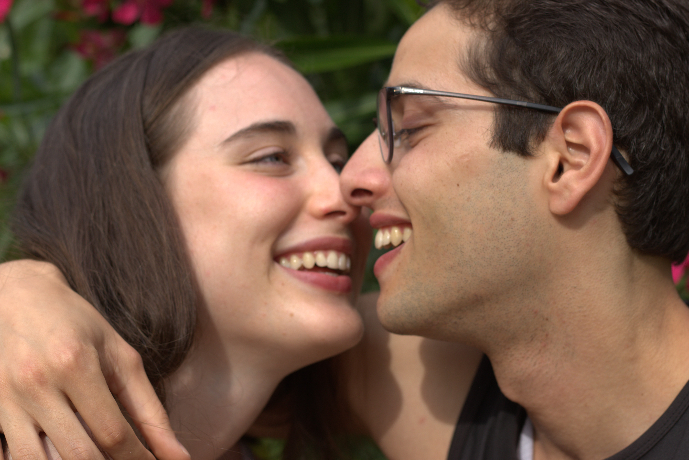

# Descobreix què és l'amor vertader

Benvinguts a la nostra pàgina web plena de tendresa i romance. 

Aquí, immergiu-vos en una història d'amor encantadora entre dues persones destinades a estar juntes, l'Ali (Nino) i l'Eva (Nina). A través d'un estudi detallat de les seves converses de WhatsApp, us convidem a descobrir els secrets de la seva relació i a respondre a la pregunta que tothom es fa; qui estima més a l'altre? 

Prepareu-vos per una experiència emocionant i captivadora, on cada missatge revela un trosset més del seu amor inquebrantable. Us guiarem a través dels seus moments més dolços i íntims, explorant les emocions profundes i els vincles que els uneixen. Acompanyeu-nos en aquest viatge apassionant ple de moments tendres, rialles i, sobretot, amor sincer. Deixeu-vos endur per aquesta història romàntica que us farà creure en el poder de l'amor verdader. 

Feliços 25 anys, amor de la meva vida. 

T'estimo més que mai.

# Qui som?

Va somiar que després de la universitat, els seus amics li van presentar una noia que mai havia vist en la seva vida, amb el nom de Nicolet. Seguint la lògica dels somnis, després de saludar-la, li va prendre la mà i van sortir a passejar cap a casa seva. No obstant això, aquest passeig no va ser un passeig normal dins d'un somni; va experimentar una sensació extremadament realista que el va fer oblidar tot el que l'envoltava, centrant-se únicament en la felicitat que sentia amb la Nicolet. Van parlar de tot i van mantenir converses profundes sobre ells mateixos. Recorda cada paraula que van intercanviar i cada emoció que va experimentar. En arribar a casa, es va sentir molt abatut perquè se n'havia d'anar, així que va decidir acompanyar-la a casa seva, maximitzant així el temps amb ella. Durant aquest viatge, només recorda com la va fer riure molt i com, en un dels seus adorables riures, ella va mossegar-li el genoll mentre estaven asseguts al bus, una mossegada que va sentir com si fos real i dolça. Va ser en aquest moment que es va enamorar d'ella, tot dins d'un somni!

La pitjor part estava a punt de començar: el despertar. Així que, quan es va despertar, es va sentir furios i decebut que tot el que havia viscut només existís dins la seva ment, malgrat haver-ho considerat 100% real.

Mentre encara estave al llit, enmig d'aquest mar de decepció, va recordar d'on havia sorgit el rostre de la Nicolet al seu cap: era una noia que només havia vist en una foto de perfil de WhatsApp durant 5 segons, uns dies abans del somni: l'Eva. Va tornar a mirar la foto i es va adonar que cada detall del seu rostre coincidia amb el de la Nicolet del seu somni. Com podia la seva ment crear-la de manera tan perfecta amb només 5 segons o menys de veure la seva foto? Estava en un grup de WhatsApp (amb algunes persones que mai havia vist, incloent-la) d'un amic que volia organitzar quedades, ja que eren nous a la universitat. Mentre l'Ali estava somiant aquella nit, els del grup havien parlat de quedar el dia després d'Halloween per anar a "la bolera", i ella hi era inclosa. Després del somni i de revisar els missatges, es va sentir molt eufòric perquè ara podia conèixer aquesta còpia de la Nicolet en la vida real. Tenia l'oportunitat de fer realitat el seu somni! No obstant això, també tenia por que la noia no tingués la mateixa personalitat que la Nicolet del seu somni, o fins i tot que fos lleugerament diferent de la seva foto de perfil (insisteix, s'havia enamorat de la noia del seu somni i només volia veure-la de nou tal com la recordava).

Així doncs, avui va sortir amb aquest grup i la va veure. ERA EXACTAMENT IGUAL A LA NICOLET DEL SEU SOMNI! Però el millor de tot, era que tot d'ella era Nicolet: la seva rialla, la seva amabilitat i la seva personalitat. Ara, es sentia molt feliç per haver experimentat una sensació tan meravellosa que havia convertit literalment un somni en realitat. Estava realment impressionat de com tot s'havia alineat de manera tan perfecta i havia pogut conèixer la Nicolet. Ara, l'únic que volia era assolir el mateix nivell de felicitat que havia experimentat en el seu somni. Aquesta era ara la seva nova meta a la vida.

La tarda del 18 de Novembre de 2018, sota la calmant pluja que banyava el Poblenou, l'Ali va confessar el seu somni a l'Eva; ella no podia para de somriure mentre l'Ali li explicava tot. En aquell mateix instant, l'Eva també va revelar el seu amor cap a ell, un amor que havia nascut el dia que es van trobar per primera vegada a "la bolera".

Cinc anys i quatre mesos més tard, la flama del seu amor segueix creixent amb intensitat. Esdevenint un exemple de puretat i devoció, ambdos representen l'essència mateixa de l'amor autèntic.

  

