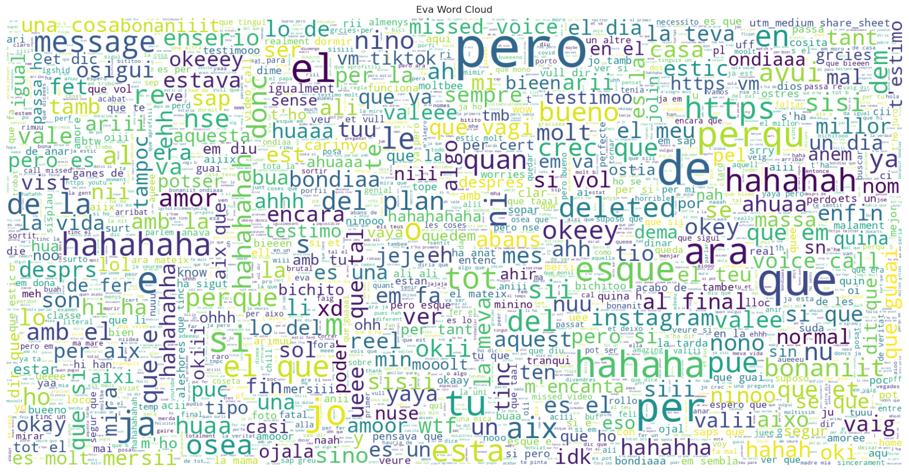
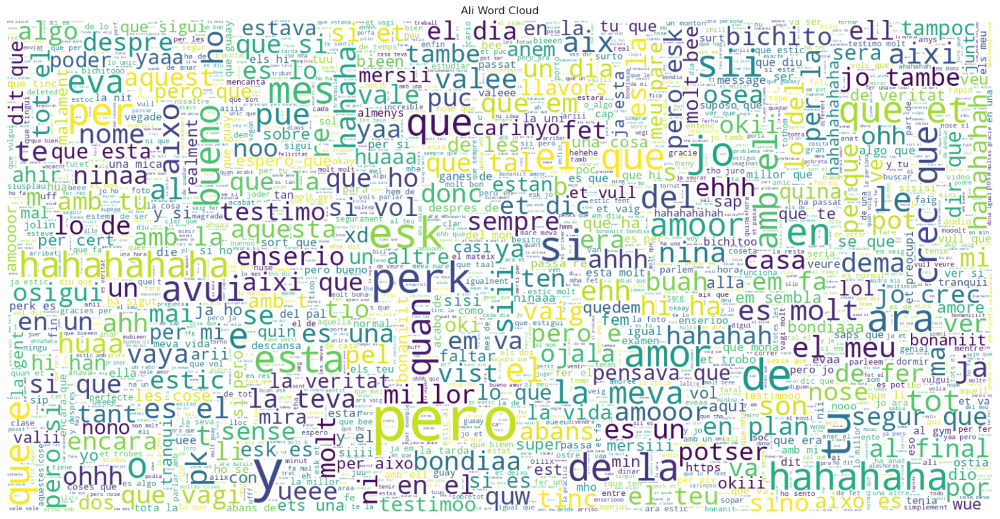

# És tan parlanxina?

Ja hem constatat que l'Ali envia més missatges que l'Eva, però encara no podem concloure que sigui més expressiu que ella; ella amaga una arma secreta: els temibles audios.

L'Ali els té por extrema, ja que representen minuts interminables on les paraules flueixen sense pausa. Ella és capaç de dedicar fins a 7 minuts d'audio per explicar com un gat mimós li fa companyia mentre sopava a la universitat, o què tan bonica troba l'arquitectura de Barcelona. I si no responc a un d'ells, sense dubte, rebre una reprimenda, marcant-me amb un punt els audios sense resposta.

L'Eva envia de mitjana 4,5 audios més que l'Ali, sort que Whatsapp va incloure l'opció de reproducció a doble velocitat...

D'altra banda, ella envia el doble de fotos i vídeos que ell, cosa que a l'Ali no li molesta en absolut, ja que ella és tan preciosa i l'ha enamorat completament... En aquest cas, és l'Ali qui es molesta quan l'Eva li envia fotos que només ha vist una sola vegada.

Finalment, tenim els stickers: el gran descobriment d'Eva per fer riure a l'Ali. Aquí trobem el mític "Voy a cometer la automorisión". Són una forma vital d'expressió per a l'Eva, mostrant amor, cansament, odi, tendresa, humor, entre altres emocions.

  

  <!-- Replace the following line with your actual graph code -->
  <iframe src="assets/plots/003_Media.html" style="width: 100%; height: 600px; border: none;"></iframe>

# Pluja de paraules

  

  

